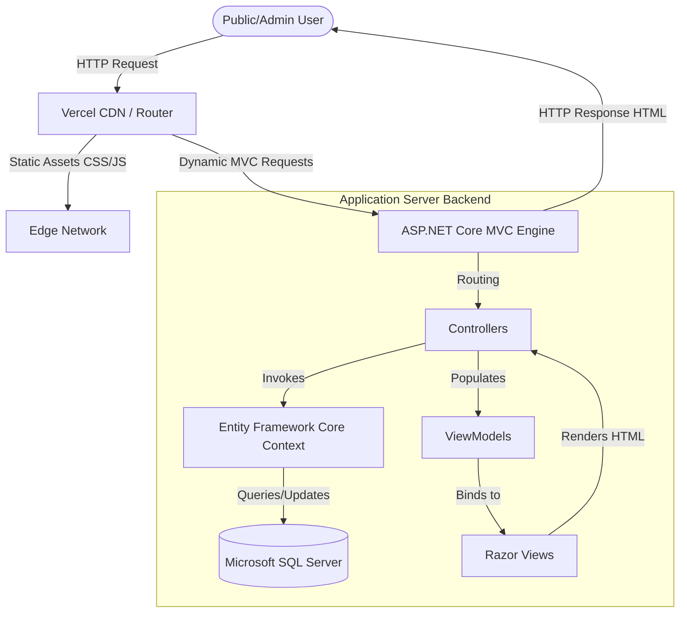
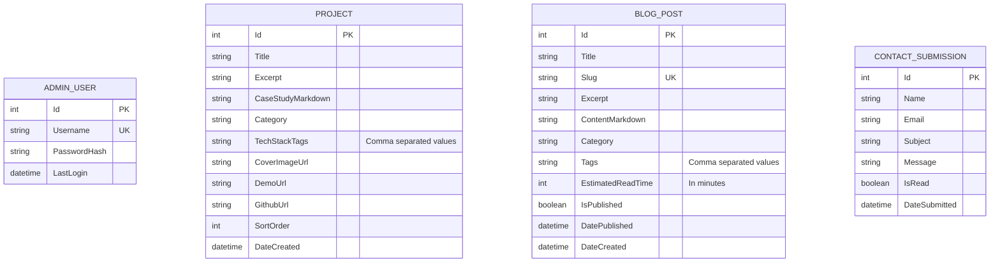

# System Design Document (SDD)
## Project: Minimalist Full-Stack Portfolio & Blog Engine

---

## 1. Architectural System Design

This portfolio application is built using the standard model-view-controller (**MVC**) pattern in **ASP.NET Core**. The system separates concern levels to facilitate low visual latency, secure CMS data updates, and highly optimized database querying.

### 1.1 High-Level Component Flow


### 1.2 Structural Code Layout (ASP.NET Core MVC)
```
/WebApplication1
│   Program.cs                    # Application setup, Middleware, Dependency Injection
│   appsettings.json              # Configuration and connection strings
│   appsettings.Development.json  # Dev-specific configs
│
├───Controllers                   # Core logic orchestrators
│       HomeController.cs         # Serves static/public main routes
│       ProjectsController.cs     # Manages list & detail project views
│       BlogController.cs         # Manages public reading feeds
│       AdminController.cs        # Authenticated CMS control logic
│
├───Models                        # Domain entities & database maps
│   │   Project.cs                # Project record data model
│   │   BlogPost.cs               # Blog article data model
│   │   ContactSubmission.cs      # Recruiter contact records
│   │   AdminUser.cs              # Authentication settings
│   │
│   └───ViewModels                # UI-specific typed binding structures
│           HomeViewModel.cs
│           BlogDetailViewModel.cs
│           AdminDashboardViewModel.cs
│
├───Views                         # Razor View templates (.cshtml)
│   │   _ViewStart.cshtml         # Global configurations
│   │   _ViewImports.cshtml       # Directives and shared namespaces
│   │
│   ├───Home
│   │       Index.cshtml
│   │
│   ├───Projects
│   │       Index.cshtml          # Project gallery page
│   │       Details.cshtml        # Deep case-study layout
│   │
│   ├───Blog
│   │       Index.cshtml          # Blog feed page
│   │       Details.cshtml        # Distraction-free article reader
│   │
│   ├───Admin
│   │       Login.cshtml          # Minimal auth portal
│   │       Dashboard.cshtml      # CMS Management Console
│   │
│   └───Shared
│           _Layout.cshtml        # Main layout, script imports, navbar, footer
│
├───wwwroot                       # Static client-side assets
│   ├───css
│   │       site.css              # Custom minimalist overrides
│   ├───js
│   │       site.js               # Lightweight scroll & filter actions
│   └───lib
│           bootstrap/            # Bootstrap 5 framework folder
│           lucide/               # Minimalist svg icons
```

---

## 2. Relational Database Schema (SQL Server)

To support complete administrative management (CRUD) of blog entries and project showcases, a relational database model is built using **Microsoft SQL Server**. Database communication is abstracted using **Entity Framework Core (EF Core)** under a Code-First model.

### 2.1 Entity Relationship Diagram (ERD)


### 2.2 Table Schema Definitions

#### A. Table: `AdminUsers`
Stores authorized login credentials for dashboard administration.
*   `Id` (INT, Primary Key, Identity): Unique ID.
*   `Username` (NVARCHAR(50), Unique, Not Null): Login name.
*   `PasswordHash` (NVARCHAR(256), Not Null): Argon2/BCrypt secure hash of password.
*   `LastLogin` (DATETIME, Nullable): Tracks system access timestamps.

#### B. Table: `Projects`
Holds individual case study items displayed in the `/projects` directory.
*   `Id` (INT, Primary Key, Identity): Unique ID.
*   `Title` (NVARCHAR(150), Not Null): Project name.
*   `Excerpt` (NVARCHAR(300), Not Null): Brief summary on cards.
*   `CaseStudyMarkdown` (NVARCHAR(MAX), Not Null): Entire details in Markdown format.
*   `Category` (NVARCHAR(50), Not Null): Filter category (e.g., "Web", "AI", "Mobile").
*   `TechStackTags` (NVARCHAR(250), Not Null): Delimited skills list (e.g., "React, .NET, EF Core").
*   `CoverImageUrl` (NVARCHAR(2083), Nullable): Link to external S3/Vercel blob asset.
*   `DemoUrl` (NVARCHAR(2083), Nullable): Live application link.
*   `GithubUrl` (NVARCHAR(2083), Nullable): Source code repository link.
*   `SortOrder` (INT, Default 0): Grid arrangement priority.
*   `DateCreated` (DATETIME, Default `GETDATE()`): Timestamp.

#### C. Table: `BlogPosts`
Feeds the `/blog` dynamic reading layout.
*   `Id` (INT, Primary Key, Identity): Unique ID.
*   `Title` (NVARCHAR(200), Not Null): Heading.
*   `Slug` (NVARCHAR(220), Unique, Not Null): SEO-friendly URL segments (e.g., `building-clean-mvc-core`).
*   `Excerpt` (NVARCHAR(400), Not Null): Short text preview.
*   `ContentMarkdown` (NVARCHAR(MAX), Not Null): Post text formatted in Markdown.
*   `Category` (NVARCHAR(50), Not Null): Categorization tag.
*   `Tags` (NVARCHAR(250), Nullable): Searchable terms.
*   `EstimatedReadTime` (INT, Not Null): Reading time duration.
*   `IsPublished` (BIT, Default 0): Active visible state.
*   `DatePublished` (DATETIME, Nullable): Release date.
*   `DateCreated` (DATETIME, Default `GETDATE()`): Database timestamp.

#### D. Table: `ContactSubmissions`
Captures communications initiated via public portfolio structures.
*   `Id` (INT, Primary Key, Identity): Unique ID.
*   `Name` (NVARCHAR(100), Not Null): Recruiter name.
*   `Email` (NVARCHAR(256), Not Null): Contact destination address.
*   `Subject` (NVARCHAR(150), Not Null): Subject heading.
*   `Message` (NVARCHAR(2000), Not Null): Body details.
*   `IsRead` (BIT, Default 0): Processed indicator.
*   `DateSubmitted` (DATETIME, Default `GETDATE()`): Timestamp.

---

## 3. API & Controller Endpoint Definitions

### 3.1 Public Portfolio Controller (`HomeController.cs`)
Handles all landing page elements.
*   `GET /` (`Index` Action)
    *   **Description**: Pulls brief list of projects (ordered by `SortOrder`) and recent blogs. Binds them to `HomeViewModel` and returns public landing page view.
*   `POST /contact` (`SubmitContact` Action)
    *   **Description**: Receives contact form payload. Performs validations, sanitizes fields, writes records to `ContactSubmissions`, and outputs AJAX response:
        `{ "success": true, "message": "Thank you for reaching out!" }`

### 3.2 Projects Router (`ProjectsController.cs`)
Bypasses monolithic pages, rendering projects in independent views.
*   `GET /projects` (`Index` Action)
    *   **Description**: Pulls all projects, categorizes them, and returns gallery list directory views.
*   `GET /projects/{id}` (`Details` Action)
    *   **Description**: Searches database for matching project record. Converts `CaseStudyMarkdown` content to HTML, and loads layout template with project case details.

### 3.3 Blog Feed Controller (`BlogController.cs`)
*   `GET /blog` (`Index` Action)
    *   **Description**: Renders published `BlogPosts` (where `IsPublished = true`) ordered chronologically. Supports search queries (`?q=`) and category filtering (`?category=`).
*   `GET /blog/{slug}` (`Details` Action)
    *   **Description**: Fetches blog using `slug` search. Reads `ContentMarkdown`, parses safely using a server-side Markdown-to-HTML parser (such as *Markdig*), estimates reading progression, and returns clean reader layouts.

### 3.4 Authenticated Administration (`AdminController.cs`)
*   `GET /admin/login` (`Login` Action)
    *   **Description**: Serves minimalist secure authentication login view.
*   `POST /admin/login` (`Authenticate` Action)
    *   **Description**: Validates admin details, sets secure HTTP-only cookies, and routes to `/admin/dashboard`.
*   `GET /admin/dashboard` (`Dashboard` Action)
    *   **Description**: Authorizes access. Fetches full database stats, list of logs, and contact submissions. Renders CMS home.
*   `POST /admin/blog/create` | `POST /admin/blog/edit/{id}` | `POST /admin/blog/delete/{id}`
    *   **Description**: Authorizes actions, updates database context states (`BlogPosts`), and redirects back to dashboard panels.
*   `POST /admin/project/create` | `POST /admin/project/edit/{id}` | `POST /admin/project/delete/{id}`
    *   **Description**: Authorizes actions, processes asset URLs, updates `Projects` collections, and returns redirects.

---

## 4. Deployment Strategy: Hybrid Vercel / Container Model

To respect the user's constraints while providing a highly resilient structure, we choose a **Hybrid Hosting Architecture**. ASP.NET MVC requires active server frameworks, which run best in continuous environments (preventing heavy cold starts inherent in Vercel's serverless nodes).

```
   ┌─────────────────────────────────────────────────────────────┐
   │                       VERCEL EDGE                           │
   │  - Houses Static UI Assets (wwwroot/css, JS, images, PDFs)   │
   │  - Acts as reverse proxy, caching static pages on CDN       │
   └───────────────┬─────────────────────────────────────────────┘
                   │
                   │ (Proxies Dynamic Views)
                   ▼
   ┌─────────────────────────────────────────────────────────────┐
   │             CONTAINER SERVICE (Railway / Render)            │
   │  - Runs the active Dockerized ASP.NET Core MVC Application   │
   │  - Handles server-side Razor rendering & active controllers │
   └───────────────┬─────────────────────────────────────────────┘
                   │
                   │ (Database Connection Pool)
                   ▼
   ┌─────────────────────────────────────────────────────────────┐
   │             CLOUD DATABASE (Azure SQL / Neon MS SQL)        │
   │  - Dedicated managed SQL Server hosting the schema tables   │
   └─────────────────────────────────────────────────────────────┘
```

### 4.1 Production Dockerfile Setup
Deploying to Railway or Render requires a standard C# multi-stage production Dockerfile in the project root:

```dockerfile
# Stage 1: Build Environment
FROM mcr.microsoft.com/dotnet/sdk:8.0 AS build-env
WORKDIR /app

# Copy csproj and restore dependencies
COPY *.csproj ./
RUN dotnet restore

# Copy remaining code files and build release
COPY . ./
RUN dotnet publish -c Release -o out

# Stage 2: Runtime Environment
FROM mcr.microsoft.com/dotnet/aspnet:8.0
WORKDIR /app
COPY --from=build-env /app/out .

# Expose ports and set system environment variables
ENV ASPNETCORE_URLS=http://+:8080
EXPOSE 8080

ENTRYPOINT ["dotnet", "WebApplication1.dll"]
```

### 4.2 Database Hosting Configuration
1.  **Azure SQL Database (Recommended / Free Tier compatible)** or **Aiven for SQL Server**: Provides managed relational hosting with active firewalls.
2.  **Connection Strings**: Kept safe inside Environment Variables on the Application container dashboard (`ConnectionStrings__DefaultConnection`), fully encrypted:
    `Server=tcp:yourserver.database.windows.net,1433;Initial Catalog=PortfolioDb;Persist Security Info=False;User ID=dbadmin;Password=YourSecurePassword;MultipleActiveResultSets=True;Encrypt=True;TrustServerCertificate=False;Connection Timeout=30;`

### 4.3 Vercel Integration
To configure Vercel to route your domains and cache files smoothly, place a custom `vercel.json` file in the project directory:

```json
{
  "version": 2,
  "rewrites": [
    { "source": "/css/(.*)", "destination": "/wwwroot/css/$1" },
    { "source": "/js/(.*)", "destination": "/wwwroot/js/$1" },
    { "source": "/lib/(.*)", "destination": "/wwwroot/lib/$1" },
    { "source": "/(.*)", "destination": "https://your-mvc-app.up.railway.app/$1" }
  ]
}
```
*   **Result**: High-speed edge CDN delivery for frontend visuals (Bootstrap styles, JS actions) and clean reverse proxy connections back to your ASP.NET MVC backend server for all dynamic paths.
